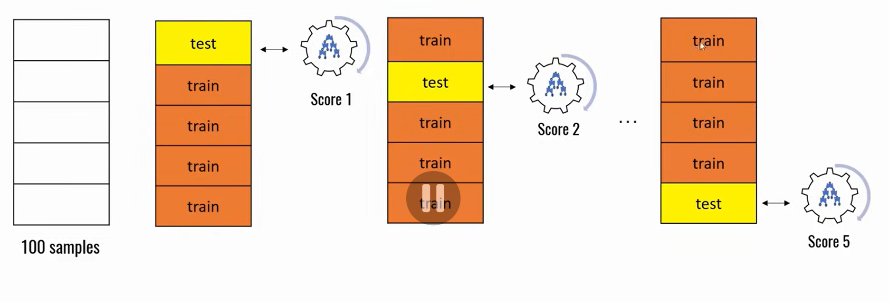

# Cross validation:

### This helps in **Evaluation** of PErformane of Different models on the same Dataset, For example We used SVM, Logistic RegressinClassification models on IRIS ds, Cross validation will help us decide which model to choose.

## Methods to Split Training DS:
- Use all available data for training and test on same dataset
- Split the availabel ds intp Training and Test DS
- K Fold Cross validation

## K FOld Cross Validation:
- The whole Datasets isdivided into FOLDS

- In the First Iteration, teh fist FOLD is considered as test DS and other 4 are train DS and calculate SCORE1
- In the second Iteration: 2nd Fold is used for training adn other 4 for testing DS and calculate SCORE2
- Similar way fpr 3rd iteration and calculate SCORE3
- This goes on till N iterations and calculate SCORE N
- Then sum up all the scores and Average the Scores , which gives Average Score.

### .StratifiedKFold():
- While seperating out the folds it seperates via Categories in a uniform way
- StratifiedkFold.split()

### .cross_val_score():
- In Built method used to find the score.

## Conclusion:
- There is no Scientific method to Determine one particular method is Perfect for this Purpose/dataset. We need train with different models with different HyperParameters to determine which model is best.