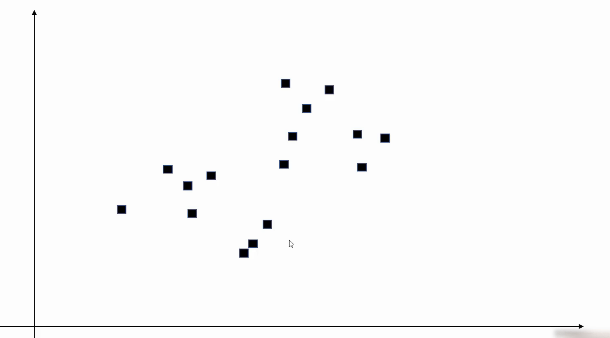
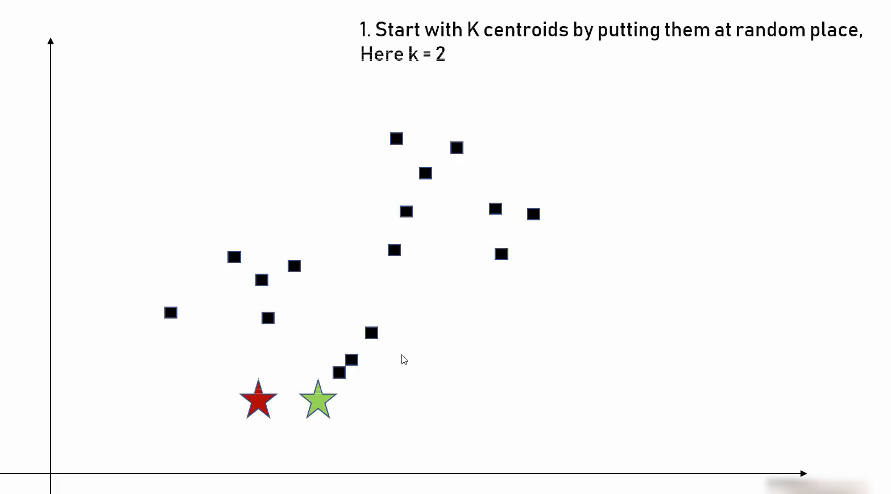
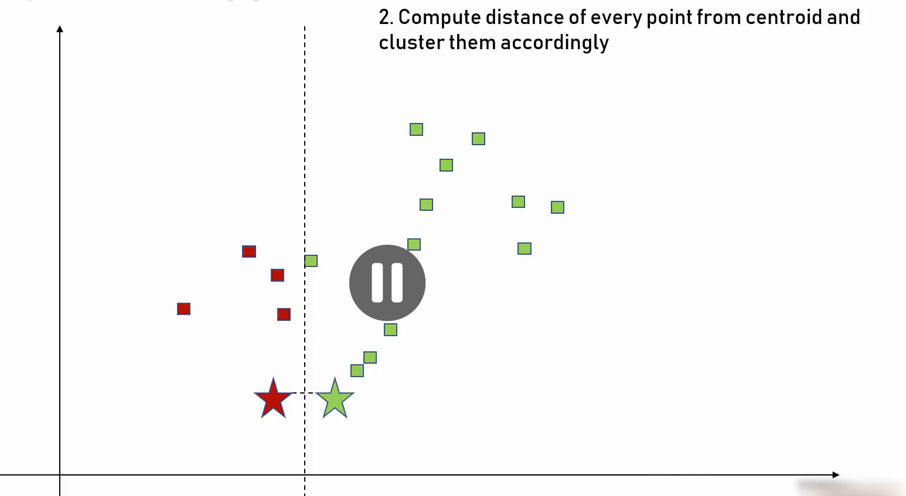
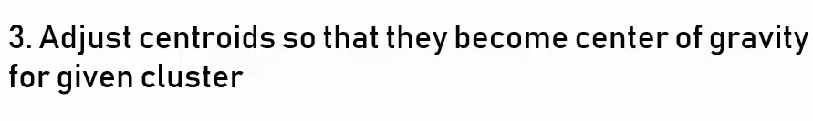
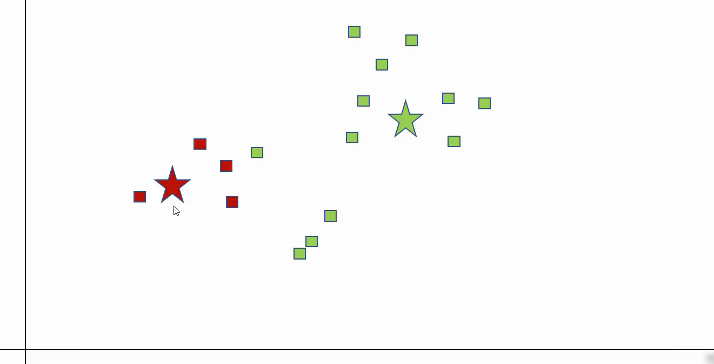
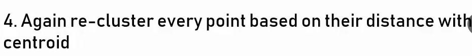
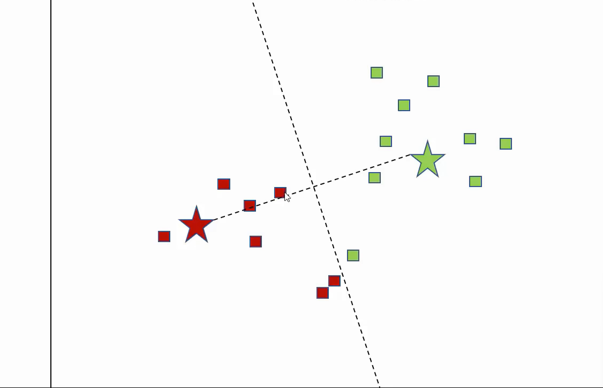
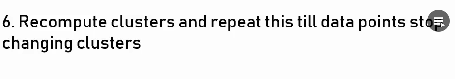
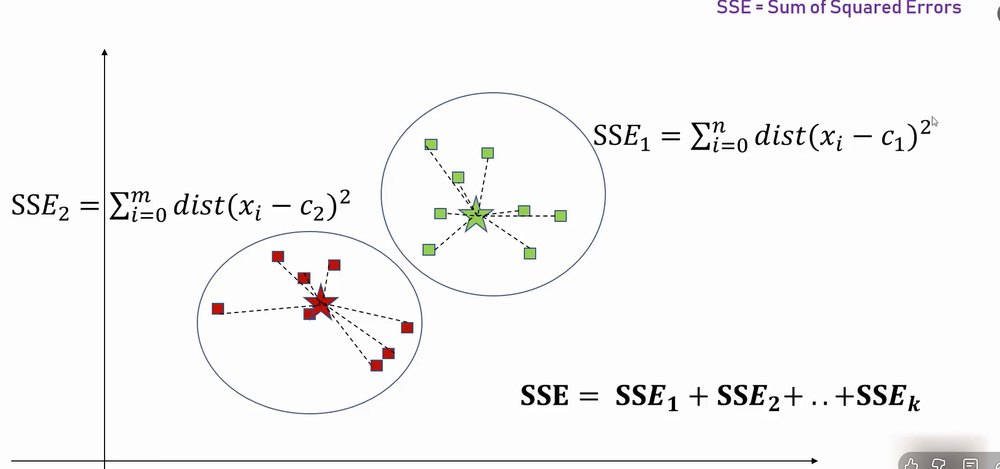
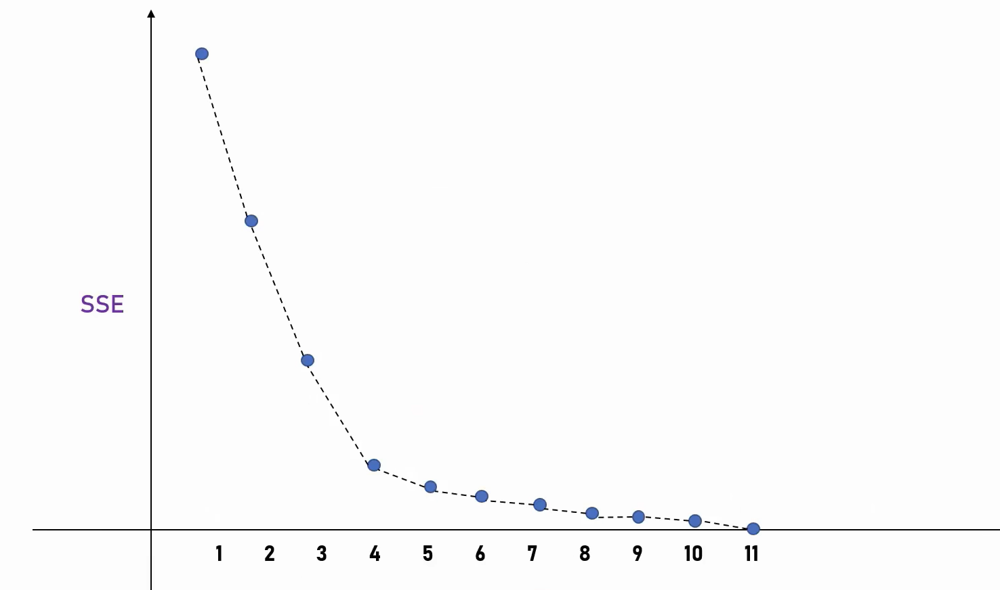

# k means Clustering Algorithm

##### This is a Unsupervised algorithm, No labelling is done.

##### K number of Random points are chosen. For our case we took 2:
##### These points are called **CENTROIDS**.

#### Next Step: To Identify the distance between each point to the centroid
##### Simplest way to do is, draw a line which is equidistant to the 2 centroids, all the points left to the CENTROID belongs to the Centroid in the left and all the points right to the centroid belongs to the centroid in the right.

#### In further steps we will make the cluster segregation better and better!

### NOTE: ASSIGNING THE VALUE OF **K** IS THE MOST IMPORTATN TASK. CHOOSE IT WISELY
#### **ALGO METHOD**: METHOD TO DETERMINE THE VALUE OF K
##### 1) START WITH SOME 'K'
##### 2) FOR EACH OF THE STABILISED CLUSTER FIND THE SUM OF SQUARED ERRORS

##### 3)  REPEAT 1) AND 2) FOR DIFFERENT VALUES OF K
##### BELOW IS GRAPH FOR EXPERIMENTING WITH DIFFERENT VALUES OF K

####    GENERAL GUIDELINE: FIND THE ELBOW POINT OF THE GRAPH (ELBOW TECHNIQUE), NOW WHEN YPU SEE THE ABOVE GRAPH, K=4 IS THE ELBOW POINT

### km.cluster_centers_ gives set of Centroids and their coordinmates in the plot
