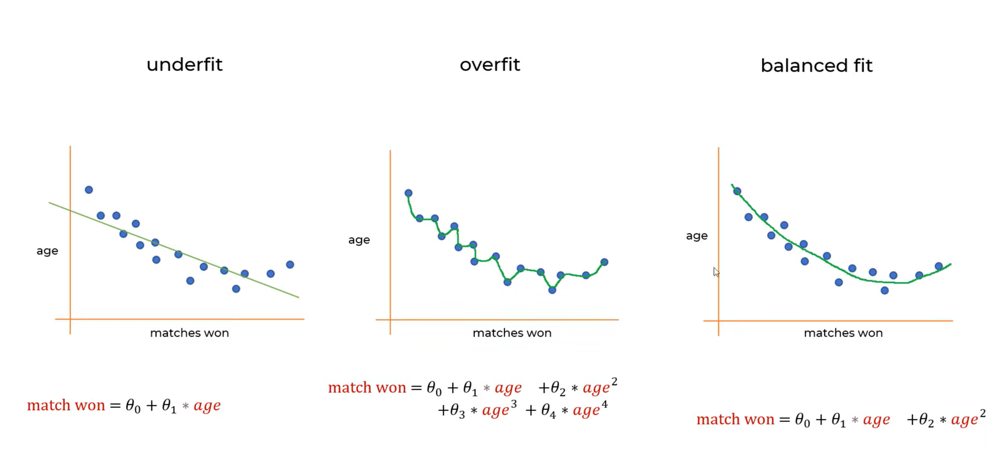
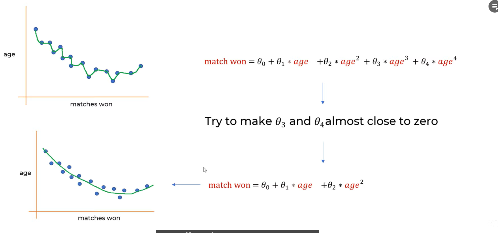
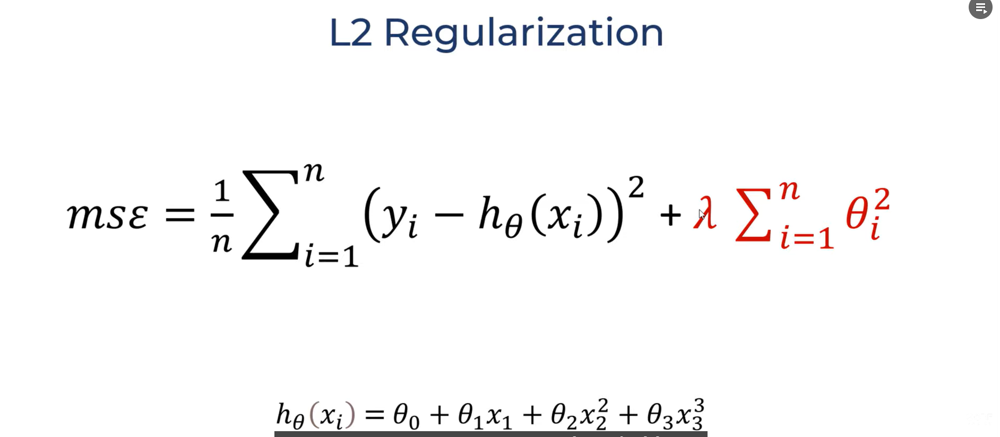
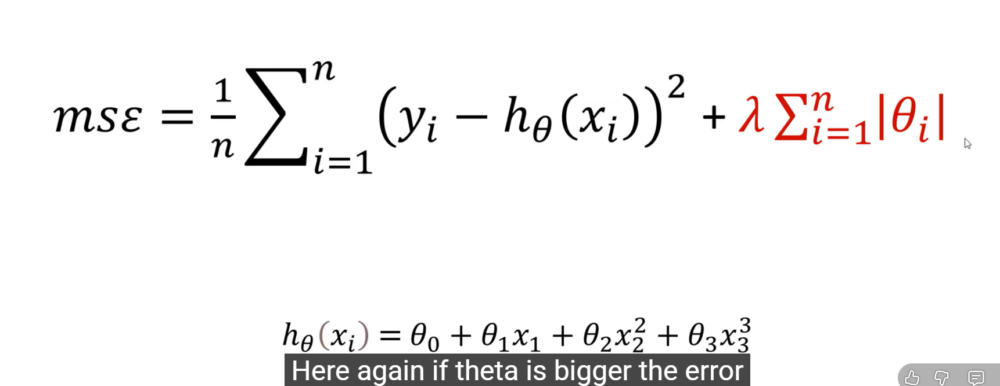

# L1 & L2 Regularization
## l1 and l2 are some of the techniques used to solve the  issue of OVERFITTING.

#### Overfitting: If we train out Data too much it would just predict COMPLETELY BASED ON TEH FEED IN DS, which in turn leads to increase in error rate of Testinmg DS.

#### HOW TO **REDUCE OVERFITTING**:

#### In this polynomila regression, if we make the THETA3 and THETA4 close to Zero, then the resulting equation equates to:

#### If we do this, we will get a better polynomial for Prediction

## L2 Regularization (aka Ridge Regularization):

## L1 Regularization(aka Lasso Regularization):
