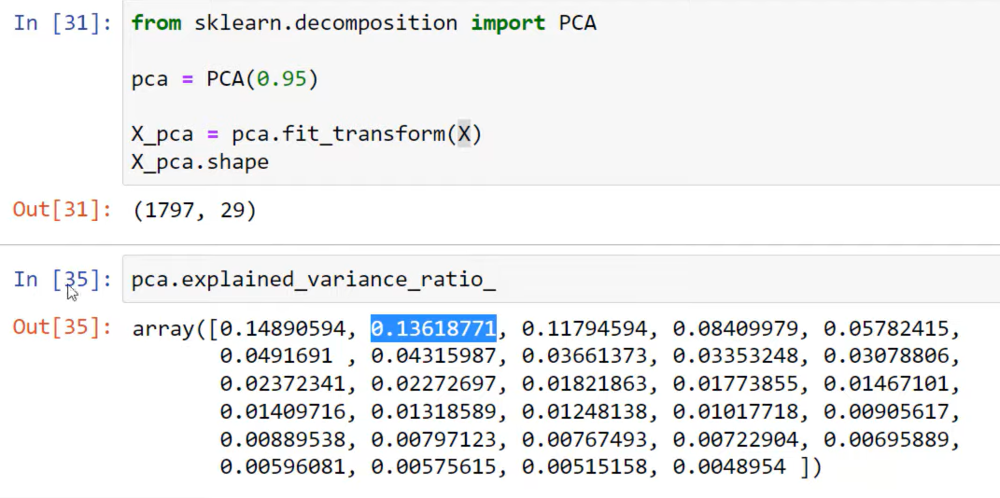
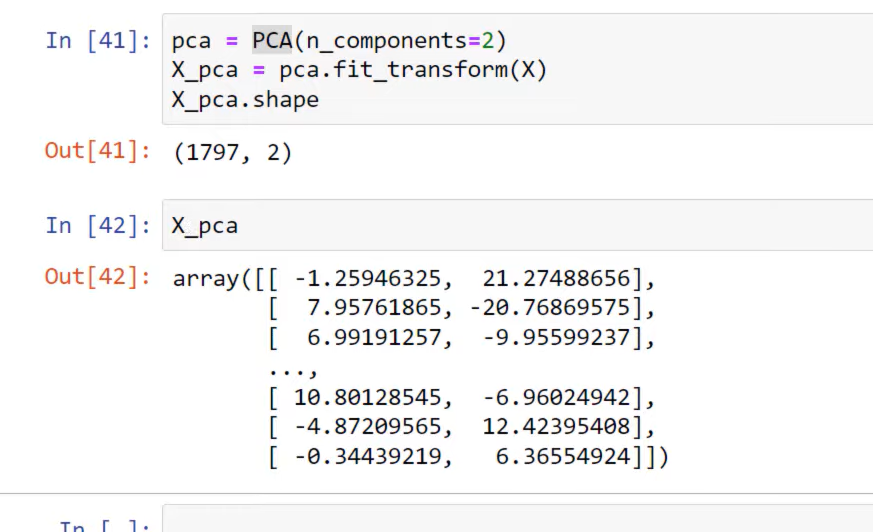

# Principal Component Analysis:

#### When you see the Image, the two Yellow Pixels doesnt contribute anyting in PRedicting the value of handwritten number. So, What if we ge rid of those **Unimportant Features**

#### IF we do that:

### Principal Component Analysis is called Dimensionality Reduction Technique as it can help us Reduce Dimensions.

#### PCA(n_components= n), THrough this command we are asking the CPA to find out 'n' IMPORTANT COMPONENTS . This function creates new components and name them: PC1,PC2,PC3,PC4 and soo on. IN THIS PC1 Covers the most Variancein terms ofm Features and INformation PC2 is second most Highest componentthat has lot of information about FEATURES in the dataset

### from sklearn.decomposition import PCA
#### model = PCA(.95) . the .95 here means , we are telling the pca to retain 95% if the information.

### Things to Keep in mind before Principal Component Analysis:
#### Scale the Features before applying Principal COmponent Analysis. ( ex: MinMaxScaler())
#### In this we are gonna use StandardScaling from preprocessing module

### in this code snippet , the highlighted 0.136187  means, the second Column holds 13% variance (or useful Features in the DAtaset) 

### in this 'n_components' means we are instructing the PCA to divide teh Dataset into only 2Principla COmponents