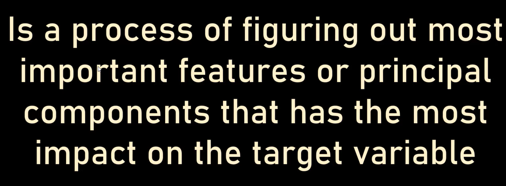
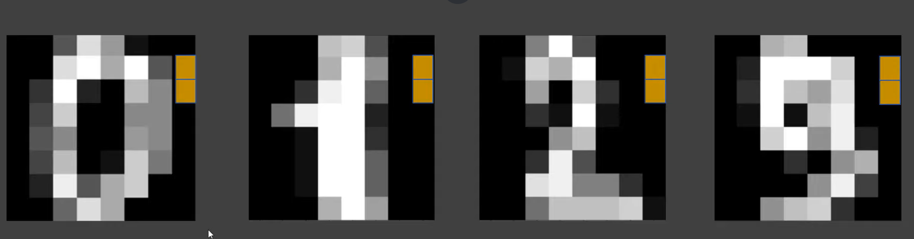

# Principal Component Analysis:

#### When you see the Image, the two Yellow Pixels doesnt contribute anyting in PRedicting the value of handwritten number. So, What if we ge rid of those **Unimportant Features**

#### IF we do that:
