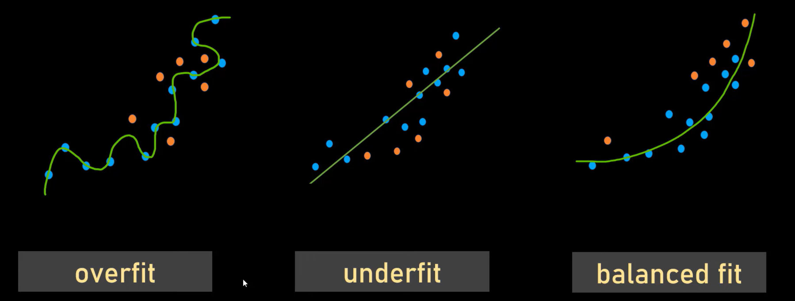
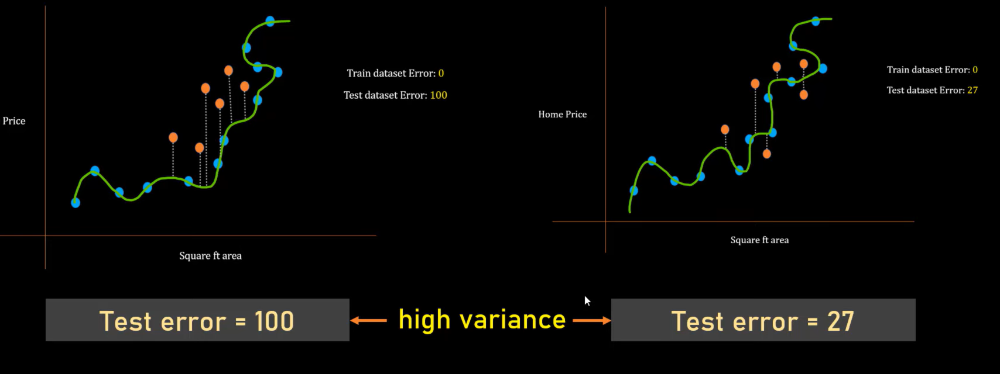
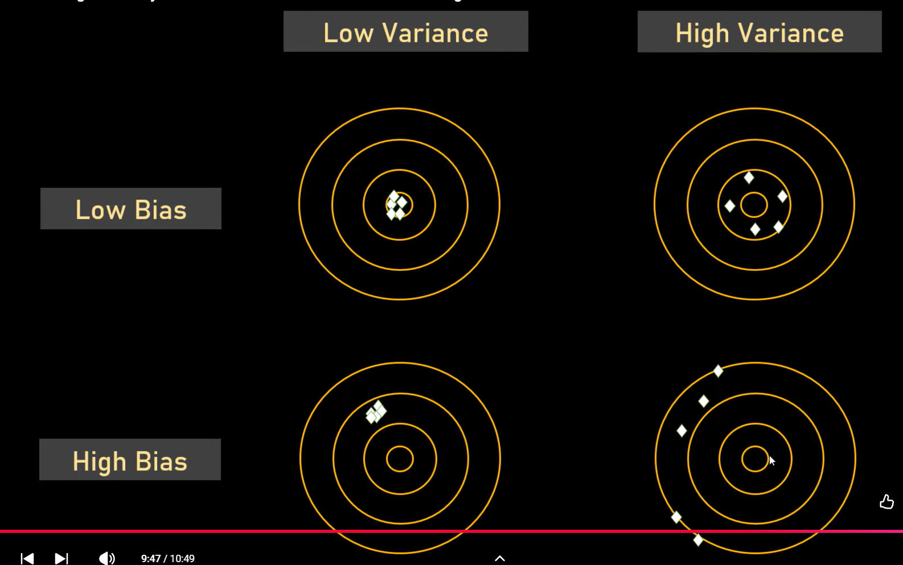

# Bias vs Variance:

### **Variance**: Determines how much the Test Error **varies** with different version of the  Split of Dataset through which the model is trained
### **Bias**: Measure of how much the Train Error varies with Different version of the Datasets through which the model is trained
###  In **Underfitting Model**
#### -  There is Low VARIANCE in Test Error.
#### - The **Train Error** is High, Therefore has High Bias
#### - **High Bias is a measurement of hiow accurately a model can capture a pattern in a TRAININF Dataset**

### In **Overfitting Model**
#### High variance in the **Test error** based on what Training  samples we are selecting (in this case **train error** is Zero)

### In **Balanced Fit model**
#### - Low Test variance
#### - Low Bias     

### Easy way to Remember:

### Methods to get Balanced fit Models:
#### - K-Fold Classification - CROSS VALDIATON
#### - L1 & L2 Clustering - REGULARIZATION
#### - Principal Component Analysis - DIMENSIONALITY REDUCTION
#### - Bagging , boosting - ENSEMBLING TECHNIQUES
 