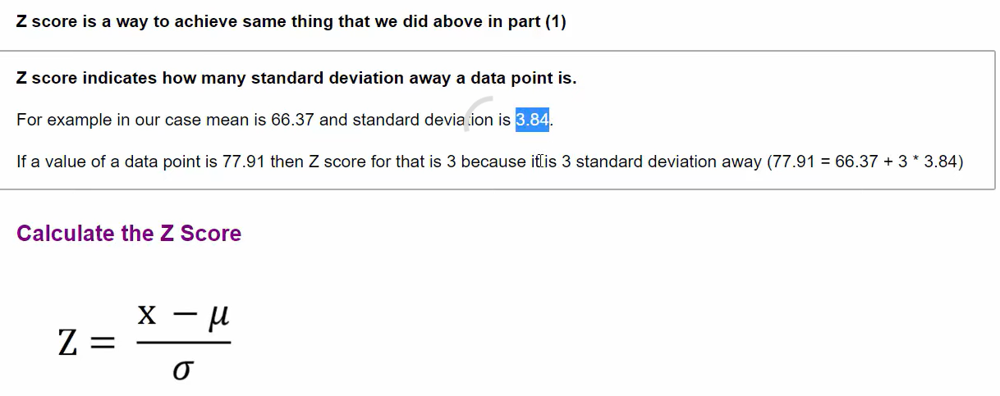
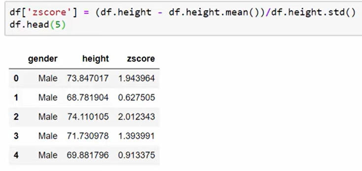

# Z- Score:
## - Tells How many Standard Deviations we are AWAY from the Mean.
## - If the Datapoint is 3 Standard Deviation away from the mean, then the Z score is 3, if its 2.5 then Z=2.5

## - X is the DataPoint Mue is the Mean, and teh sigma is the Standard Deviation
