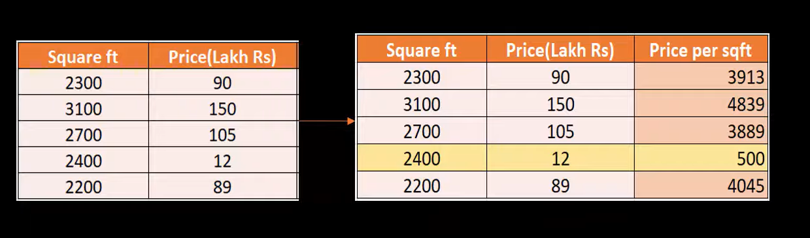
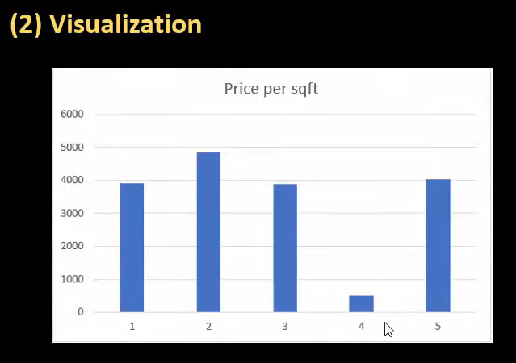

# Feature Engineering:
## Feature Engineering is the process of extracting useful features raw data using Math, Statistics and Domain knowledge. 
## Data analytics spend about 60% of their time , just cleaning the Data. 
## Featuer engineering helps the Data Analytics Engineer with Data Engineering.

## Outlier Detection:
### - Can be done with help of Expertise in the domain(**Domain Knowlledge**):
 
### Domain Expert will know that there is no house whose price per feet is less than 3500, therefore the highlighted row is an Outlier

### - Can be done using Visual Representation:

#### By plotting the Datapoint as barchat, we can see that row 4 is different from all other datapoints

### - Math/Statistics:
#### - Using Standard Deviation

## Handling Missing values

## One Hot Encoding
### ML models doesnt understand Texts, therefore we need to convert Text values into Numbers
### Can be done by converting Text Columns to Numerical Columns
