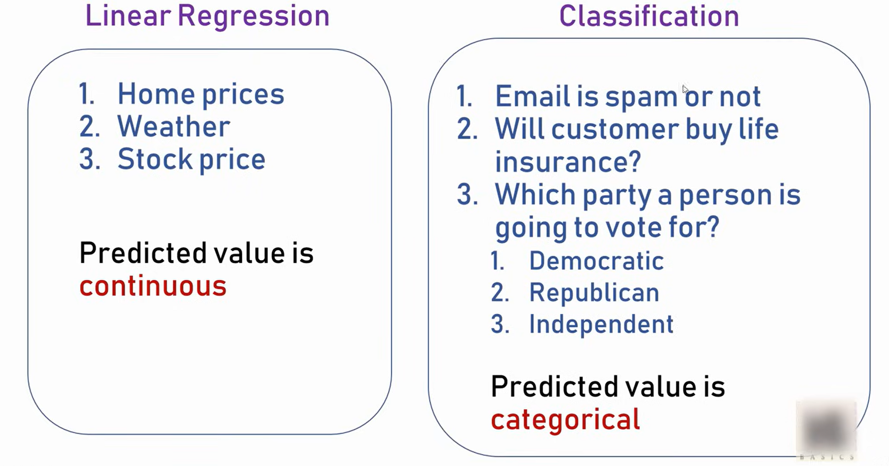
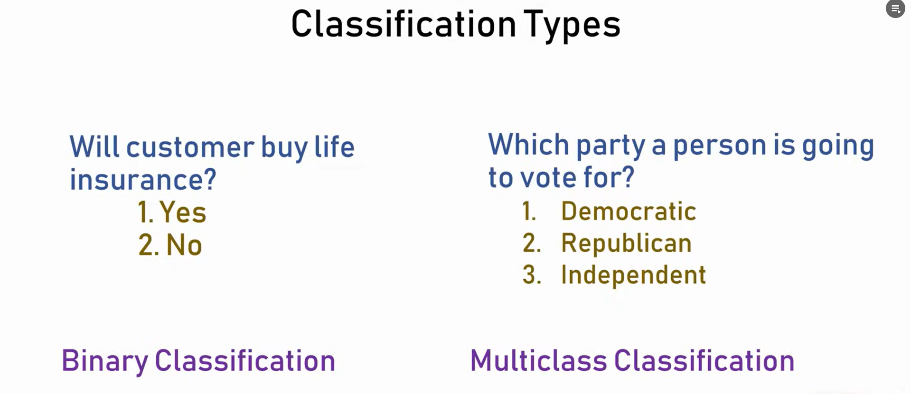
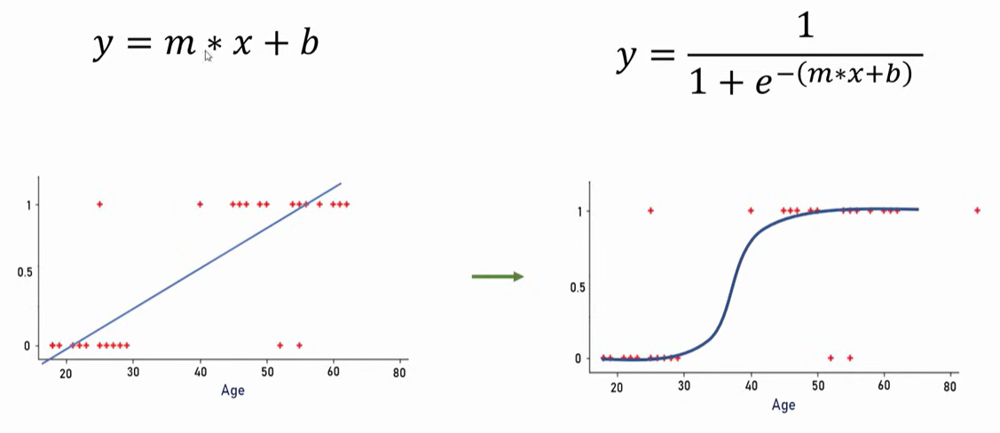
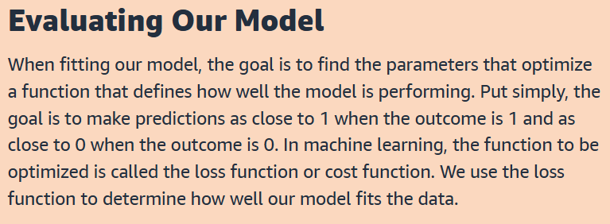
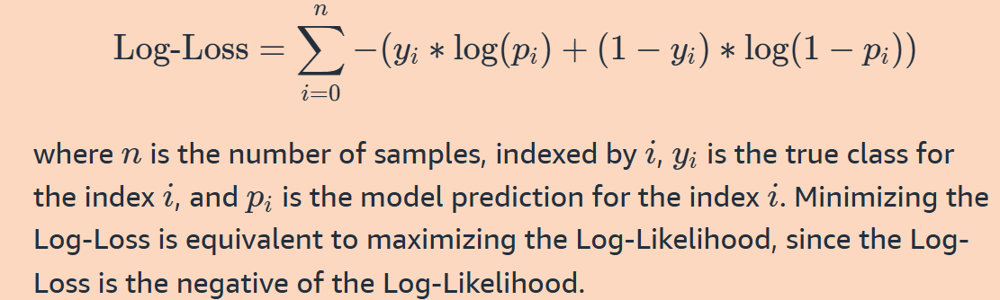

# Difference between Linear and  Logistic Regression
\

- Logistic Regression is used to solve Classification Problems.
- Linear Regression is used to predict analyse, continuous values
- Though it can be extended to more than two categories, logistic regression is often used for binary classification, i.e. determining which of two groups a data point belongs to, or whether an event will occur or not. 

## Intution to Logistic Regression

## Evaluating the Model:

## In Code:
- Dont forget to initialize max_iterations to some high value number (like 1000), otherwise error wld come that max limitations reached!