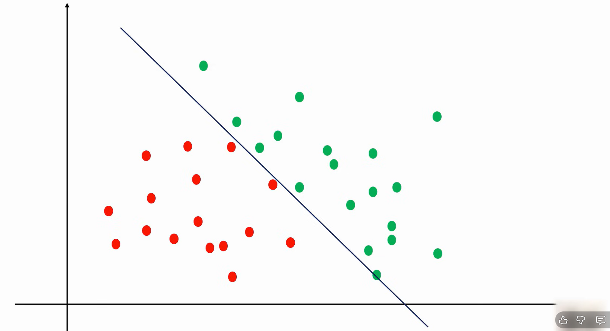

# WHen our dataset is like this its easy to draw decision boundary  with Linear Regression

# but when our DS is like this, we need to keep drawing many Decision Boundary lines

# this is what Decision Tree algorithm does for us!

# In the Image below,When the model is split in that way, in the lower region, Even though majority of the points is red, there is One Green point, which is Impurity

# Theory Part of Decision Tree