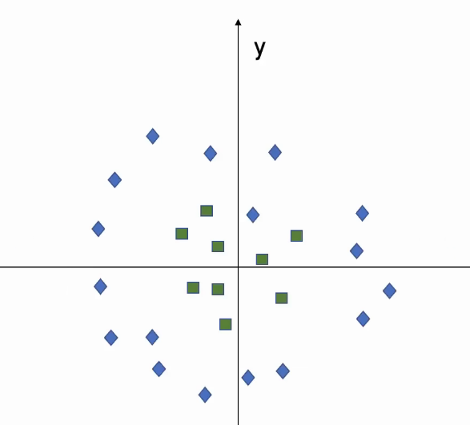
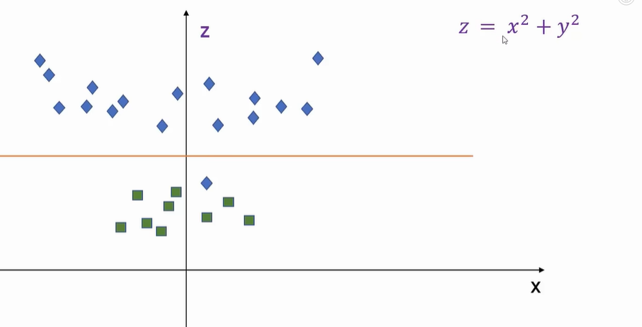

# Support Vector Machines (SVM):
## Consider this DS

## When you see, you cld notice that many Decision Boundaries can be drawn to divide points of both categories

### When you look at this the dotted line between the straight lins and the data points (the distance is called **margin**)
### Line with higher margin is BETTER

## Theory:
- distinguish between two classes by finding the optimal hyperplane that maximizes the margin between the closest data points of opposite classes.
- maximizing the margin between points enables the algorithm to find the best decision boundary between classes.
- lines that are adjacent to the optimal hyperplane are known as support vectors as these vectors run through the data points that determine the maximal margin.
- when the data is not linearly separable, kernel functions are used to transform the data higher-dimensional space to enable linear separation

#### The above data visualisation is transformed to form of the image given below, Now the data is linearly separable

- This application of kernel functions can be known as the “kernel trick”, and the choice of kernel function, such as linear kernels, polynomial kernels, radial basis function (RBF) kernels, or sigmoid kernels, depends on data characteristics and the specific use case.
### Types of SVM Classifier:
- #### Linear SVMs
- #### Non Linear SVM's
- -  Much of the data in real-world scenarios are not linearly separable, and that’s where nonliIn order to make the data linearly separable, preprocessing methods are applied to the training data to transform it into a higher-dimensional feature space.near SVMs come into play
- - higher dimensional spaces can create more complexity by increasing the risk of overfitting the data and by becoming computationally taxing.
- - The “kernel trick” helps to reduce some of that complexity, making the computation more efficient, and it does this by replacing dot product calculations with an equivalent kernel function
- ##### TYpes of Non-Linear Kernel:
- - Polynomial Kernel
- - Radial basis Kernel
- - Sigmoid Kernel

### Hyperparameter tuning
- Hyperparameters can be tuned to improve the performance of an SVM model. Optimal hyperparameters can be found using grid search and cross-validation methods, which will iterate through different kernel, regularization (C), and gamma values to find the best combination.