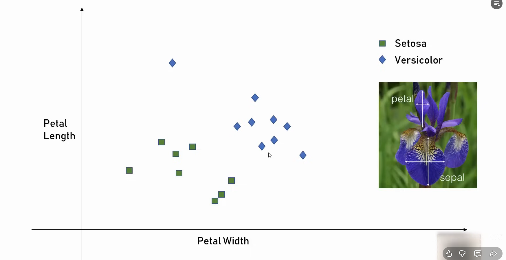
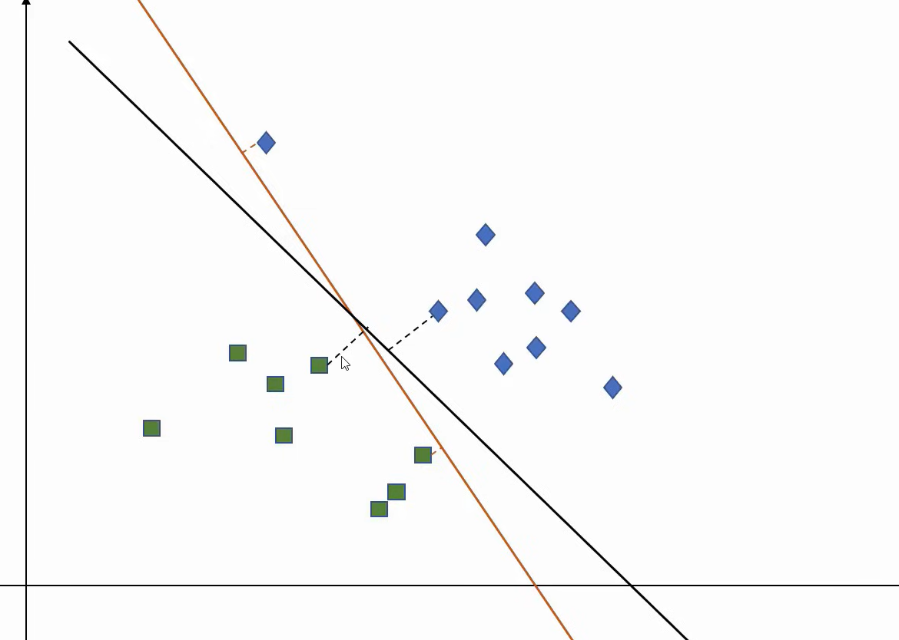
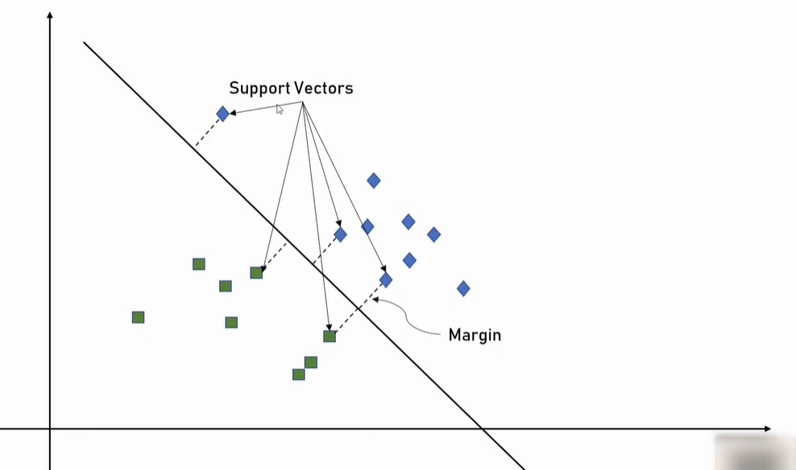

## Consider this DS

## When you see, you cld notice that many Decision Boundaries can be drawn to divide points of both categories

### When you look at this the dotted line between the straight lins and the data points (the distance is called **margin**)
### Line with higher margin is BETTER
