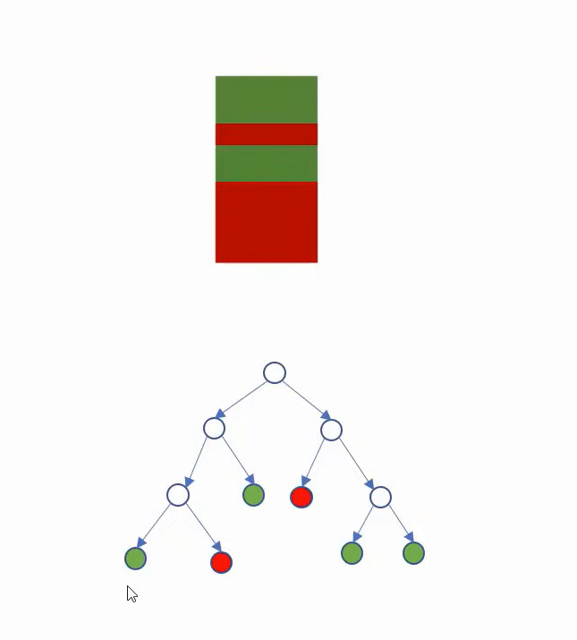
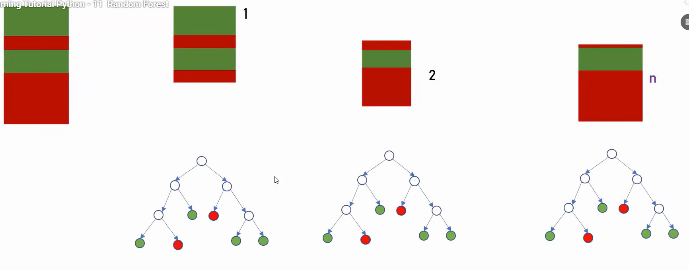
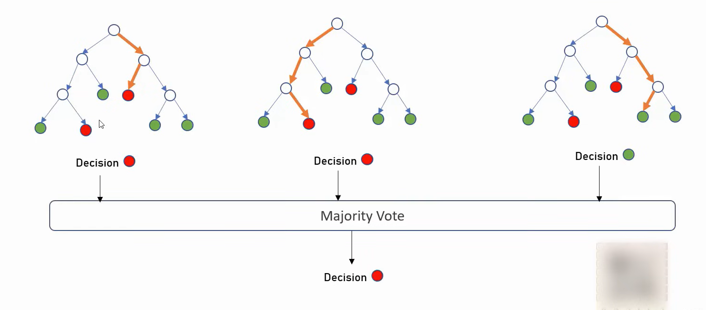

# Random Forest Tree:

- for this dataset, how can we build multiple decision trees
- Divide the dataset into  many different batch of random datasets
- Then build Decision Tree for each Dataset

- Since we did Random Sampoing its called RANDOM FOREST (As multiple random decisionn trees are there)
- Each tree comes with a decision, We will choose the decision which has been taken by majority of the trees
 
In this we are gonna use digits ds from sklearn to make classification