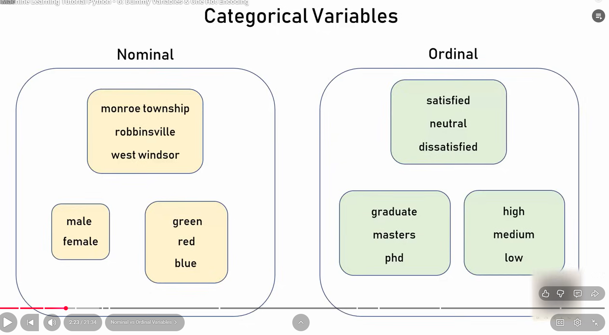
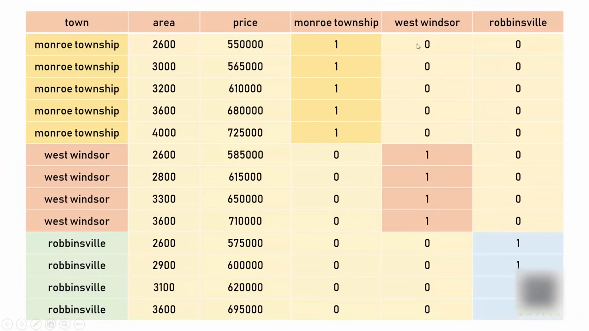

### This is the table , our aim is to train the model such that given the city name and area as input, the model should predict Price as Output.

### We cant store the town names as String

### For this, there are 2 types of variables:

#### Nominal variable doesnt have any number values associated with it , whereas Ordinal Values has number values associated with it.
## One Hot Encoding Method:

#### Here we are creating each Town as a new column and adding values 1 or 0 to the cells based on the trueness